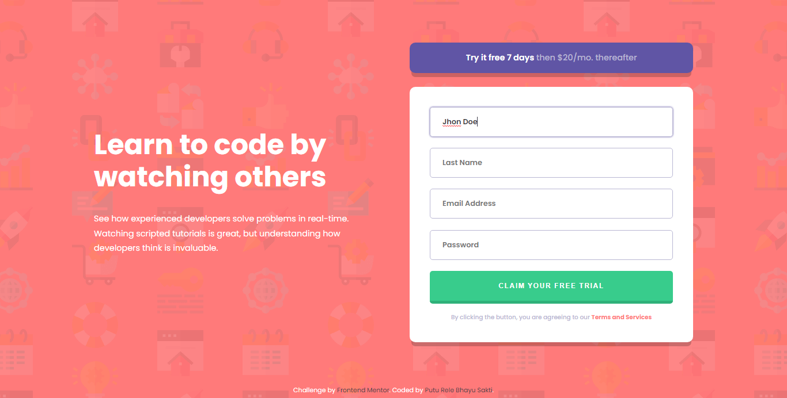
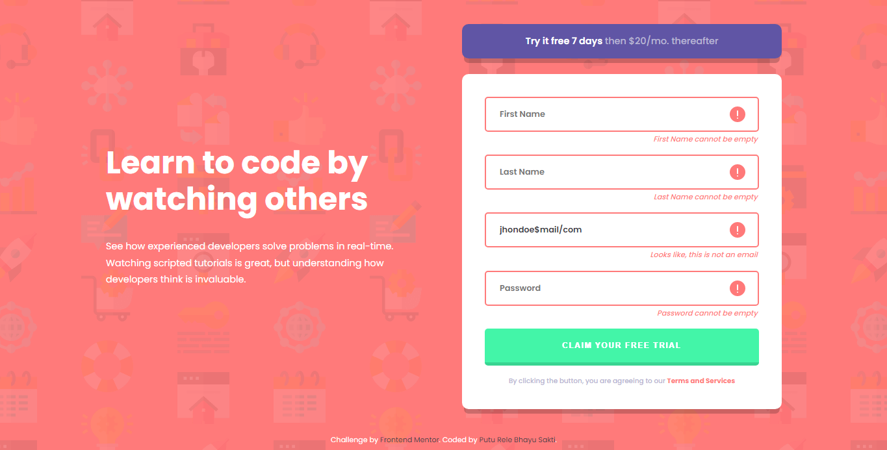
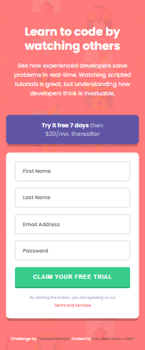

# Frontend Mentor - Intro component with sign up form solution

This is a solution to the [Intro component with sign up form challenge on Frontend Mentor](https://www.frontendmentor.io/challenges/intro-component-with-signup-form-5cf91bd49edda32581d28fd1). Frontend Mentor challenges help you improve your coding skills by building realistic projects.

## Table of contents

- [Overview](#overview)
  - [The challenge](#the-challenge)
  - [Screenshot](#screenshot)
  - [Links](#links)
- [My process](#my-process)
  - [Built with](#built-with)
  - [What I learned](#what-i-learned)
  - [Continued development](#continued-development)
  - [Useful resources](#useful-resources)
- [Author](#author)

## Overview

### The challenge

Users should be able to:

- View the optimal layout for the site depending on their device's screen size
- See hover states for all interactive elements on the page
- Receive an error message when the `form` is submitted if:
  - Any `input` field is empty. The message for this error should say _"[Field Name] cannot be empty"_
  - The email address is not formatted correctly (i.e. a correct email address should have this structure: `name@host.tld`). The message for this error should say _"Looks like this is not an email"_

### Screenshot

### Links

- Solution URL: [Solution URL here](https://www.frontendmentor.io/solutions/intro-component-with-signup-form-using-css-grid-flexbox-and-js-QWy0CE5xir)
- Live Site URL: [Live site URL here](https://lere22.github.io/intro-component-with-sign-up-form/)

## My process

### Built with

- Semantic HTML5 markup
- CSS custom properties
- Flexbox
- CSS Grid
- Javascript

### What I learned

What i learned from creating the project Intro component with sign up form is how to use grid especially with grid template areas and create sign-up validation, still try to figure it out how to check email validation until I can get a grasp about it.

### Continued development

I want to continue this project to collaborate with my other projects in the future.

### Useful resources

- [Fonts](https://fonts.google.com/) - This helped me for choosing the font what i want.
- [Frontend Mentor Resource](https://www.frontendmentor.io/resources) - This is an amazing resource which helped me to working on frontend project.
- [W3 Schools](https://www.w3schools.com/) - This helped me for understanding the syntax of some programming language.

## Author

- Code by - Putu Rele Bhayu Sakti
- Frontend Mentor - [@lere22](https://www.frontendmentor.io/profile/lere22)
